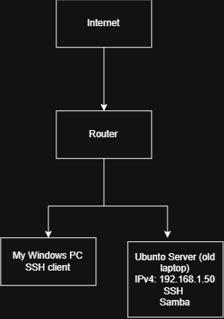

# HomeLab-Security
Building a secure Ubuntu home lab with Linux, networking, Samba, SSH, firewalls, and cybersecurity projects.
## Objective

My goal is to become a Cybersecurity Analyst by building and securing my own infrastructure instead of only studying theory.

## Current Hardware

- **Device:** Old Laptop
- **Operating System:** Ubuntu Server LTS
- **Purpose:** Home file server & cybersecurity lab

## Skills Demonstrated

- Ubuntu Server administration
- Linux command line
- User and group management
- Samba file sharing
- SSH remote access
- UFW firewall
- Basic networking (IPv4 & Static IP)
- Documentation and troubleshooting

## Project Roadmap

- [x] Install Ubuntu Server
- [x] Configure IPv4 networking
- [x] Create shared folders with Samba
- [x] Secure SSH with key authentication
- [ ] Configure UFW firewall rules
- [ ] Install Pi-hole
- [ ] Deploy Wazuh SIEM
- [ ] Perform Nmap security audit
- [ ] Analyze traffic using Wireshark

## Network Diagram

## Screenshots

Screenshots of the server configuration, terminal, and network setup will be added as the project progresses.

## What I Learned

This repository is a living portfolio. Every configuration, mistake, and solution is documented to demonstrate practical cybersecurity and system administration skills.

## Author

**Asghar Khavari**

Aspiring Cybersecurity Professional | Melbourne, Australia
